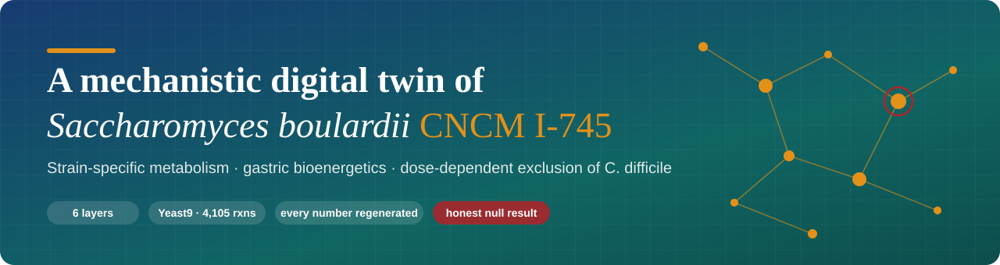
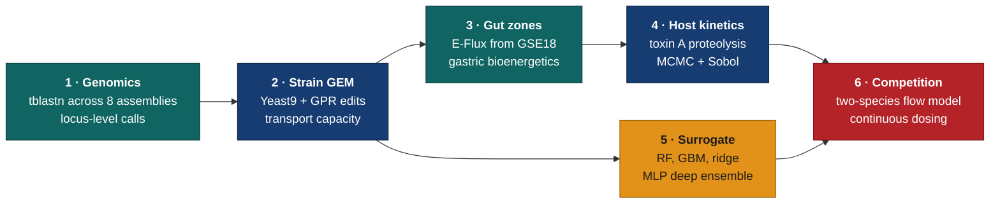
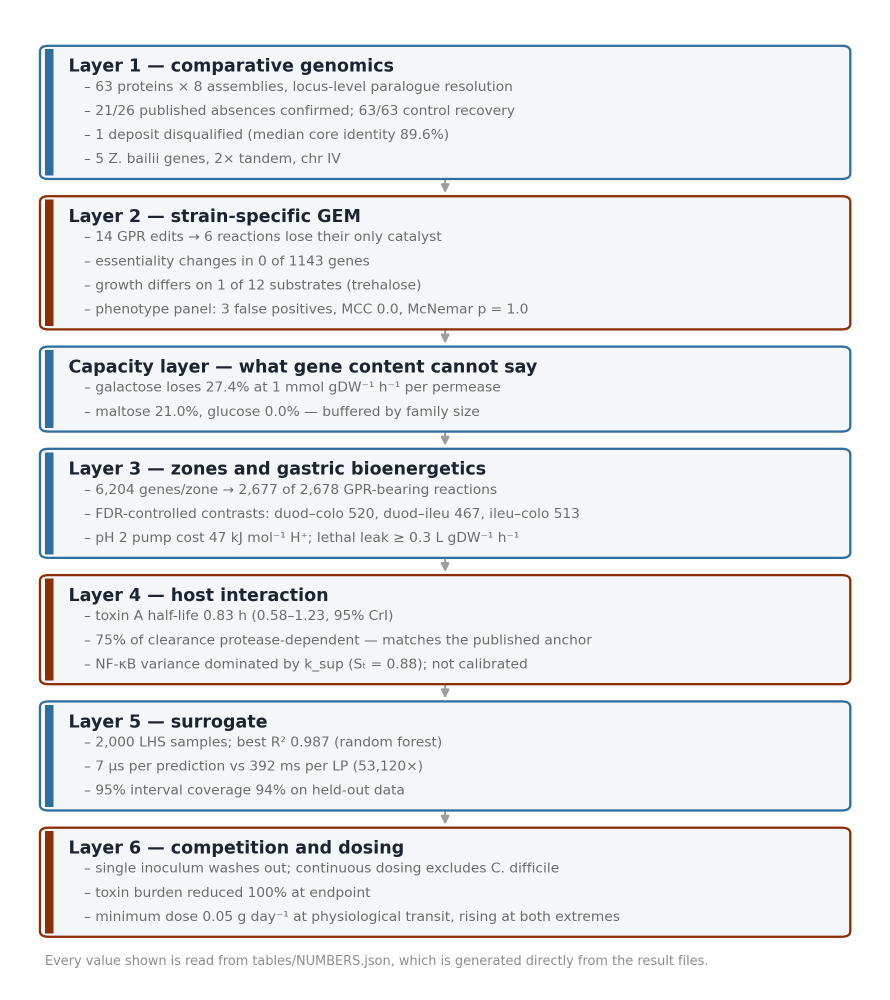
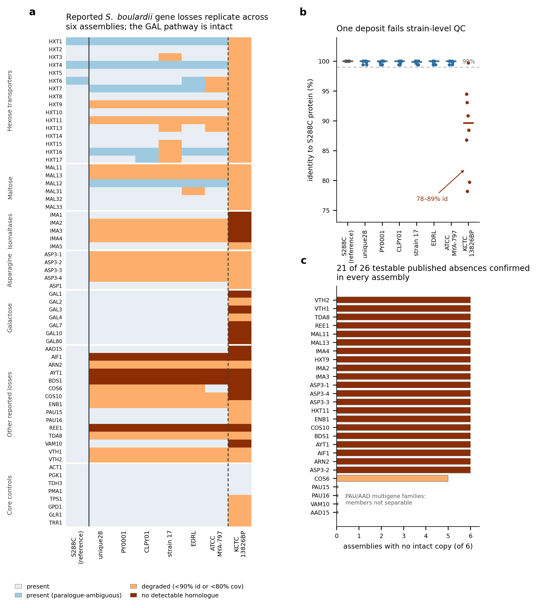
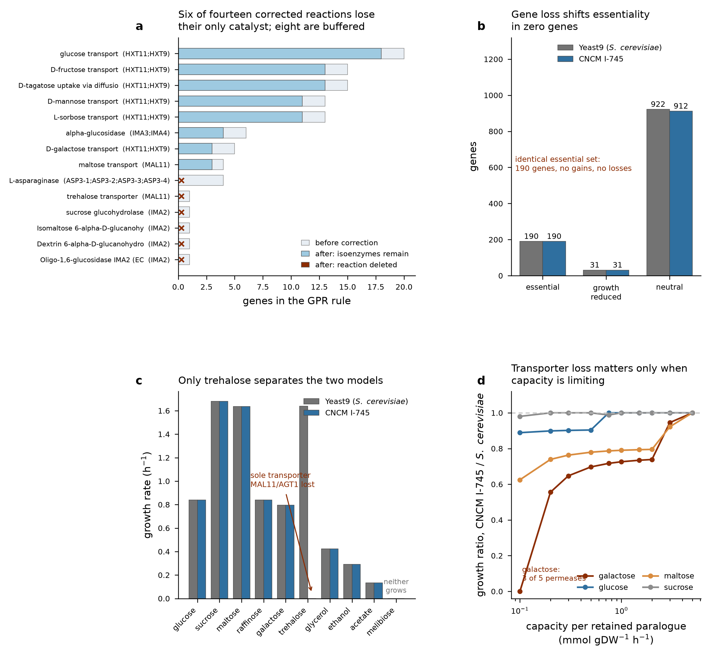
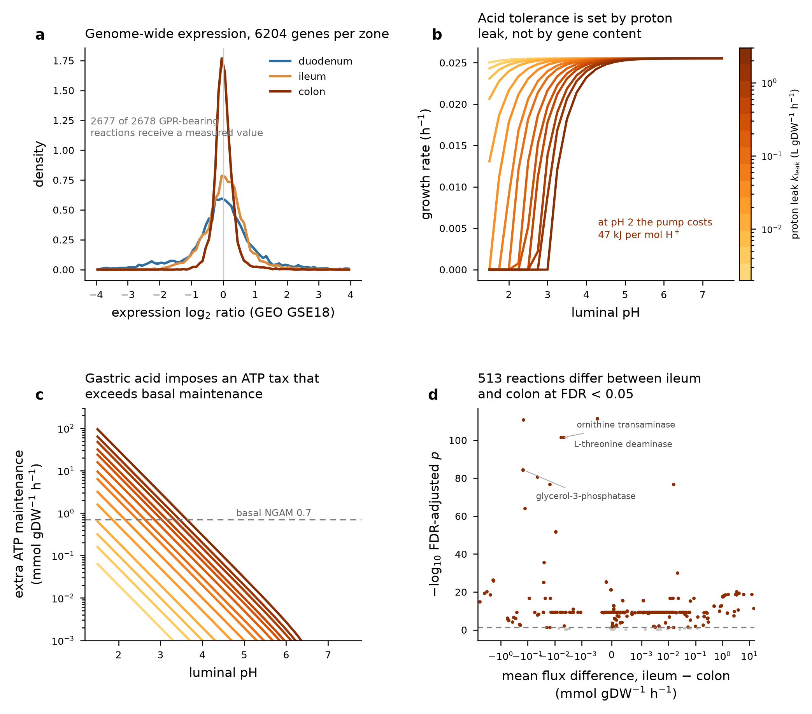
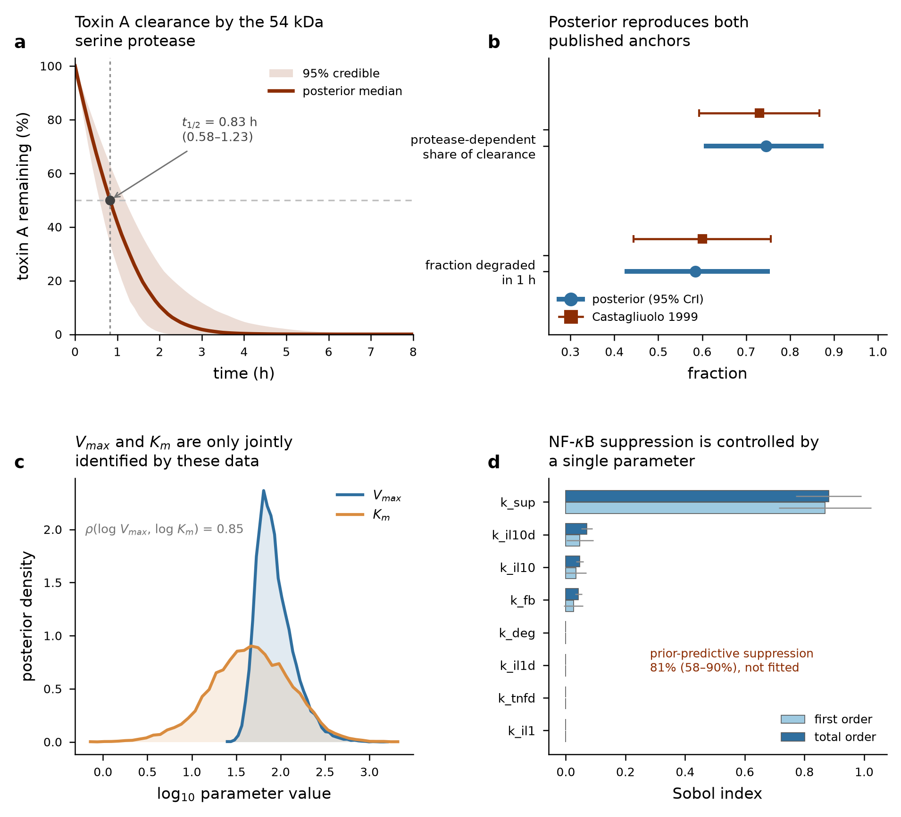
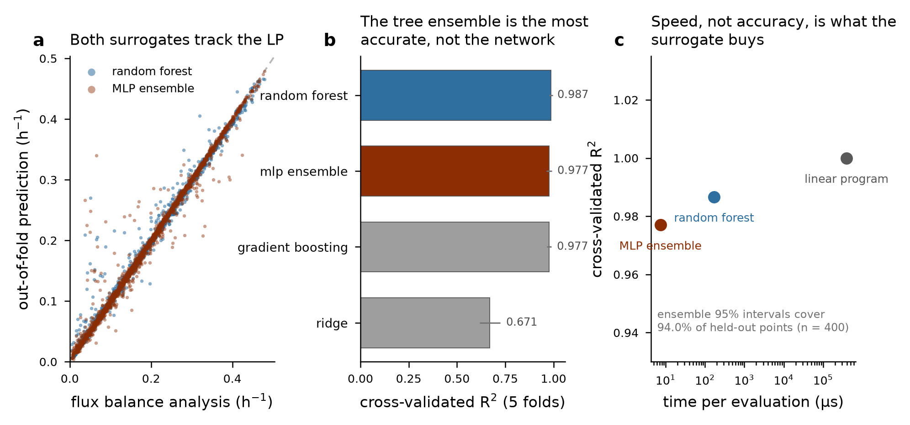
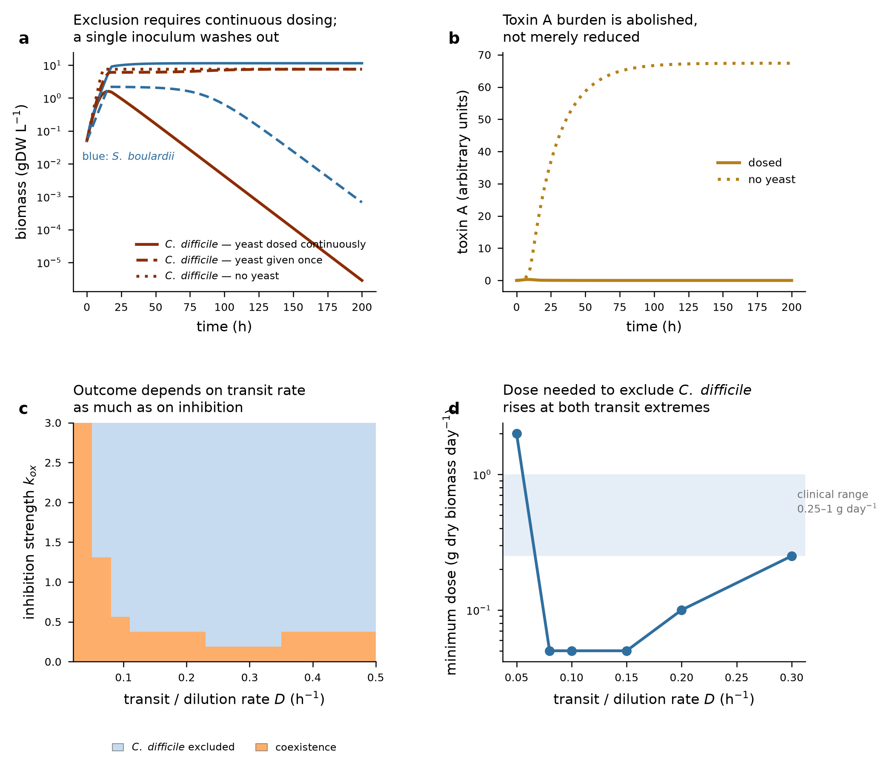

<div align="center">



<br/>

[](CITATION.cff)
[](manuscript_v4.txt)
[](environment.yml)
[](app/main.py)
[](LICENSE)
[](tables/NUMBERS.json)

**[Findings](#what-the-twin-found) · [Architecture](#architecture) · [Quick start](#quick-start) · [API](#api) · [Reproduce](#reproduce-the-analysis) · [Errata v3 → v4](ERRATA_v3_to_v4.md) · [Cite](#cite)**

</div>

---

## Why this repository exists

*Saccharomyces cerevisiae* var. *boulardii* CNCM I-745 is the yeast most widely used as a clinical probiotic, yet quantitative models of what it does in the gut are thin. Existing strain-specific reconstructions take the literature's list of lost genes, delete them from a consensus model, and assume the result behaves like a different organism.

This project tests that assumption directly, then builds the parts that do change behaviour: transport capacity, gastric proton-pump cost, calibrated toxin proteolysis, and competition with *Clostridioides difficile* under dosing.

Everything in the manuscript is regenerated from this code. `scripts/collect_numbers.py` reads the result files into `tables/NUMBERS.json`, and `scripts/build_manuscript.py` is the only thing that writes the document. No value is typed by hand.

> **Release 5.0.0 supersedes the earlier v3 / 4.0 lineage.** That work used the wrong genome accession, an incorrect gene list and a mis-attributed toxin activity. [`ERRATA_v3_to_v4.md`](ERRATA_v3_to_v4.md) lists all fourteen changed claims and why. The old code is kept, unchanged, under [`legacy_v3/`](legacy_v3/) so the history stays auditable.

---

## What the twin found

The headline result is a negative one, and it shapes the rest of the design.

<table>
<tr>
<td width="50%" valign="top">

### Gene loss alone does very little

Correcting Yeast9 for the genes *S. boulardii* has lost (14 rule edits, 6 reaction deletions) changes essentiality in **0 of 1,143 genes** and growth on **1 of 12** carbon and nitrogen sources. That one is trehalose, which falls from 1.639 to 0.000 h⁻¹ and is the model's single falsifiable prediction from gene content.

Against a sourced phenotype panel the corrected model is right on 3 of 6 representable substrates (MCC 0.00, *n* = 6) and makes exactly the same calls as the parent model (exact McNemar, 0 discordant pairs, *p* = 1.00).

</td>
<td width="50%" valign="top">

### What does change behaviour

- **Capacity.** Paralogue loss matters only when transporter capacity is limiting: galactose loses 27.4% of growth at 1 mmol gDW⁻¹ h⁻¹ per permease, maltose 21.0%, glucose 0.0%.
- **Gastric acid.** At pH 2 the proton pump costs 47.06 kJ mol⁻¹ H⁺ against 17.37 at pH 7. Survival needs a plasma-membrane proton leak below 0.3 L gDW⁻¹ h⁻¹.
- **Dosing.** A single inoculum washes out. Excluding *C. difficile* needs continuous administration, at a minimum of 0.05 g dry biomass per day at physiological transit.

</td>
</tr>
</table>

### Key numbers

| Layer | Quantity | Value |
|:--|:--|:--|
| 1 · Genomics | Published absences replicated in all 6 qualifying assemblies | 21 of 26 testable |
| 1 · Genomics | Method sensitivity on the *S. cerevisiae* control | 63 / 63 |
| 1 · Genomics | Galactose pathway (GAL1, 2, 3, 4, 7, 10, 80) | intact in every assembly |
| 2 · GEM | Essentiality changes after correction | 0 of 1,143 genes |
| 3 · Zones | Reactions constrained by GSE18 expression (6,204 genes per zone) | 2,677 of 2,678 GPR-bearing |
| 3 · Zones | FDR-significant zone contrasts (of 4,105 tested) | 520 · 467 · 513 |
| 4 · Kinetics | Toxin A half-life, median (95% CrI) | 0.83 h (0.58–1.23) |
| 4 · Kinetics | Protease share of clearance, median (95% CrI) | 0.75 (0.60–0.88) |
| 4 · Kinetics | NF-κB suppression, prior-predictive median (95% interval, *n* = 3,072) | 81% (58–90%), **not a fit** |
| 5 · Surrogate | Speed, MLP ensemble vs the LP | 7.4 µs vs 392 ms |
| 6 · Competition | Grid points with *C. difficile* excluded | 208 of 256 |

### Surrogate: measured, not asserted

Five-fold cross-validation on 2,000 Latin-hypercube samples, identical folds for every model (mean ± SD across folds, *n* = 5).

| Model | R² | MAE (h⁻¹) |
|:--|:--:|:--:|
| Random forest | **0.987 ± 0.009** | 0.0050 ± 0.0007 |
| MLP ensemble | 0.977 ± 0.015 | 0.0057 ± 0.0009 |
| Gradient boosting | 0.977 ± 0.011 | 0.0101 ± 0.0010 |
| Ridge | 0.671 ± 0.054 | 0.0467 ± 0.0014 |

The random forest is the more accurate model. The neural surrogate is kept for inference speed and for its five-member deep-ensemble uncertainty, whose 95% interval covers 94% of held-out points. The v3 convolutional network was dropped because convolution assumes locality along the input axis, and the four exchange bounds have no order.

---

## Architecture



<div align="center">

<br/><sub><b>Figure 7.</b> Every value in this summary is read from <code>tables/NUMBERS.json</code>.</sub>
</div>

| Layer | Mechanism | Main outputs |
|:--|:--|:--|
| 1 | Alignment-based presence and absence across six qualifying assemblies, with an independent *Z. bailii* introgression search | `results/layer1_*.csv` |
| 2 | GPR-corrected Yeast9, phenotype panel, essentiality screen, absolute transporter capacity | `models/yeast9_cncm_i745.xml`, `results/layer2_*.csv` |
| 3 | E-Flux zone metabolism from genome-wide microarrays; ATP cost of the proton gradient for the stomach | `results/layer3_*.csv` |
| 4 | Toxin A proteolysis calibrated by MCMC; NF-κB module as prior-predictive with Sobol indices | `results/layer4_*.csv` |
| 5 | Surrogate against cheap baselines on identical folds, with measured speed | `models/surrogate_mlp_ensemble.pkl`, `results/layer5_*.csv` |
| 6 | Two-species competition under continuous dosing, dose-response and exclusion boundary | `results/layer6_*.csv` |

<details>
<summary><b>Figures 1–6</b></summary>

<br/>

| | |
|:--|:--|
| <br/><sub><b>1.</b> Reported losses replicate across six assemblies; one deposit fails strain-level QC.</sub> | <br/><sub><b>2.</b> Fourteen edits, zero essentiality changes; only trehalose separates the models.</sub> |
| <br/><sub><b>3.</b> Zone contrasts and the ATP tax of gastric acid.</sub> | <br/><sub><b>4.</b> Toxin A clearance posterior and NF-κB sensitivity.</sub> |
| <br/><sub><b>5.</b> Speed, not accuracy, is what the surrogate buys.</sub> | <br/><sub><b>6.</b> Exclusion needs continuous dosing; the required dose rises at both transit extremes.</sub> |

</details>

---

## Quick start

```bash
git clone https://github.com/nsdeshmukh306-ai/cncm-i745-digital-twin.git
cd cncm-i745-digital-twin
conda env create -f environment.yml
conda activate sbdt
python -m uvicorn app.main:app --port 8000
```

Open <http://127.0.0.1:8000/> for the dashboard and <http://127.0.0.1:8000/docs> for the OpenAPI page. The corrected model, surrogate and every result file ship in the repository, so the service runs without re-fetching any data.

> **Windows.** The conda DLL directories must be on `PATH` before SciPy's stiff ODE solvers and GLPK will load. `conda activate` does this. Calling `envs/sbdt/python.exe` directly does not, and the failure is a silent `0xC06D007F` exit rather than an exception. If you script the activation, prepend `%CONDA_PREFIX%\Library\bin` and `%CONDA_PREFIX%\Library\mingw-w64\bin` yourself.

---

## API

Seventeen routes, one per analysis. All were exercised end to end in 20 smoke-test calls, and all passed (`results/api_smoke_test.json`).

| Method | Path | Layer | Purpose |
|:--|:--|:--:|:--|
| GET | `/health` | | Service status |
| GET | `/genome` | 1 | Assembly statistics and marker calls; `?gene=HXT9` filters |
| GET | `/introgression` | 1 | *Z. bailii* introgression on chromosome IV |
| GET | `/model_summary` | 2 | Model sizes and GPR corrections |
| GET | `/phenotypes` | 2 | Growth on carbon and nitrogen sources, base vs strain |
| POST | `/fba` | 2 | Solve the linear program under custom nutrient bounds |
| GET | `/essentiality` | 2 | Single-gene deletion screen |
| GET | `/zone/{zone}` | 3 | Expression-constrained zone metabolism |
| GET | `/zone_contrasts` | 3 | FDR-controlled between-zone contrasts |
| GET | `/ph_response` | 3 | Growth against luminal pH |
| POST | `/kinetics` | 4 | Toxin A proteolysis for chosen parameters |
| GET | `/kinetics/posterior` | 4 | Posterior summary and trajectory band |
| POST | `/predict` | 5 | Surrogate prediction, in microseconds |
| GET | `/surrogate/metrics` | 5 | Cross-validated model comparison |
| POST | `/competition` | 6 | *S. boulardii* against *C. difficile* |
| GET | `/competition/map` | 6 | Exclusion boundary |
| POST | `/query` | | Deterministic keyword routing to the routes above |

`/predict` and `/fba` are both exposed on purpose, so the speed and accuracy trade-off is visible instead of hidden. `/query` is keyword routing. It is not a language model, and its own response says so.

> **Hosted demo.** The instance at `34.14.186.73` still serves the archived v3 build from [`legacy_v3/`](legacy_v3/) and has not yet been redeployed with release 5.0.0. Use the local quick start above for the corrected model.

---

## Reproduce the analysis

Each layer runs as its own process on purpose. A genome-scale model copy costs a few hundred megabytes, and holding two of them plus a solver in one long-lived kernel is what makes this pipeline fall over on a small machine.

```bash
pwsh scripts/fetch_data.ps1          # genomes, Yeast9, BLAST+ (writes data/PROVENANCE.json)
python scripts/build_expression.py   # GSE18 zone matrices

python scripts/layer1_markers.py     # tblastn screen
python scripts/layer1_calls.py       # locus-level presence calls
pwsh scripts/introgression.ps1       # Z. bailii introgression search
python scripts/run_layer2.py base
python scripts/run_layer2.py strain
python scripts/run_essentiality.py base
python scripts/run_essentiality.py strain
python scripts/run_phenotype_matrix.py
python scripts/run_layer3.py         # zone ensembles + FDR contrasts
python scripts/run_ph.py             # gastric bioenergetics
python scripts/run_layer4.py         # MCMC + Sobol
python scripts/run_layer5_ml.py      # surrogate + baselines, from the shipped LHS labels
python scripts/run_layer6.py         # competition + dose response

python scripts/collect_numbers.py    # results -> tables/NUMBERS.json
python scripts/make_figures.py       # figures 1-7
python scripts/build_manuscript.py   # manuscript from NUMBERS.json only
```

The 2,000 Latin-hypercube FBA labels the surrogate trains on ship in `results/layer5_training_data.csv`. `scripts/run_layer5.py` is the superseded v3 driver that generated them; it also trains the old convolutional network and would overwrite the layer 5 metrics, so do not run it on a finished checkout.

`scripts/fetch_data.ps1` records the URL, accession or release tag, byte size, SHA-256 digest and retrieval time of every input in `data/PROVENANCE.json` (10 entries). If a rerun gives different numbers, comparing those digests tells you which upstream source moved.

---

## Repository layout

```text
sbdtwin/        analysis package: gem, eflux, bioenergetics, kinetics, surrogate, competition
scripts/        data acquisition, layer drivers, figure builders, manuscript build
app/            FastAPI service and single-page dashboard
data/           inputs, expression provenance, PROVENANCE.json
results/        every result CSV and JSON the manuscript reads
figures/        Figures 1-7
models/         corrected SBML model and trained surrogate ensemble
tables/         NUMBERS.json and the manuscript tables
assets/         README banner
legacy_v3/      archived v3 / 4.0 code, kept for the record
```

---

## Limitations

- **No CNCM I-745 gut transcriptome is public.** The zone layer uses *S. cerevisiae* stress-response arrays from GSE18 as proxies: heat shock for the duodenum, H₂O₂ for the ileum, hyperosmotic sorbitol for the colon. No acid-shock array exists in that series, so the stomach is modelled from bioenergetics instead. Read the zone fluxes with that in mind.
- **The phenotype panel is short by design** (6 representable substrates), fully sourced rather than padded. It has low statistical power.
- **The NF-κB module is not a fit.** No citable quantitative time course exists, so it is reported as a prior-predictive interval, and the Sobol analysis names the one parameter (`k_sup`, ST = 0.88) that would have to be measured.
- **Galactose-negative behaviour cannot come from gene loss.** All seven GAL genes are intact in every qualifying assembly, so the defect must be regulatory or allelic. This bounds what gene-content correction can deliver.
- **Five of 26 testable absences stay undetermined** (AAD15, COS6, PAU15, PAU16, VAM10). They belong to multigene families whose members alignment cannot separate.
- **One public deposit should not be used.** GCA_026225675.1 (KCTC 13826BP) has a median core-gene identity of 89.6% to *S. cerevisiae* orthologues, against 100.0% in every other assembly, and is excluded here.

---

## Cite

If you use this software or its results, please cite it. GitHub reads [`CITATION.cff`](CITATION.cff) and offers a ready-made citation from the sidebar.

```bibtex
@software{deshmukh_cncm_i745_twin_2026,
  author  = {Deshmukh, Niraj Sunil},
  title   = {A mechanistic digital twin of Saccharomyces cerevisiae var. boulardii CNCM I-745},
  year    = {2026},
  version = {5.0.0},
  url     = {https://github.com/nsdeshmukh306-ai/cncm-i745-digital-twin}
}
```

## Licence

Released under the [MIT licence](LICENSE). Models and data derived from third-party sources, including Yeast9 and the NCBI and GEO records listed in `data/PROVENANCE.json`, keep the terms of their original providers.

<div align="center"><sub>Niraj Sunil Deshmukh · Indian Institute of Science Education and Research Tirupati</sub></div>
