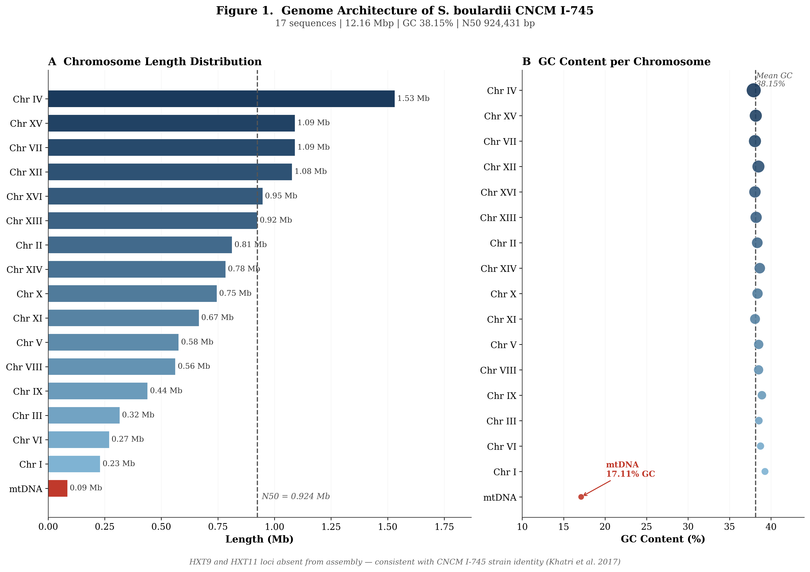
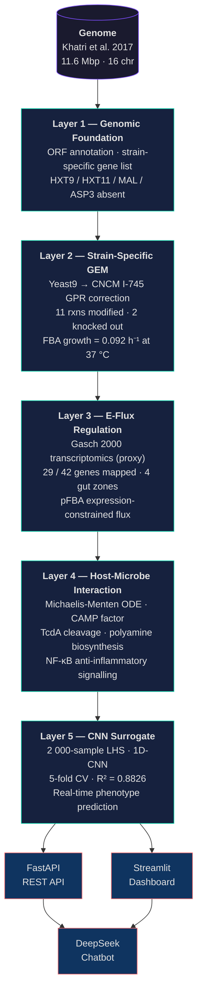
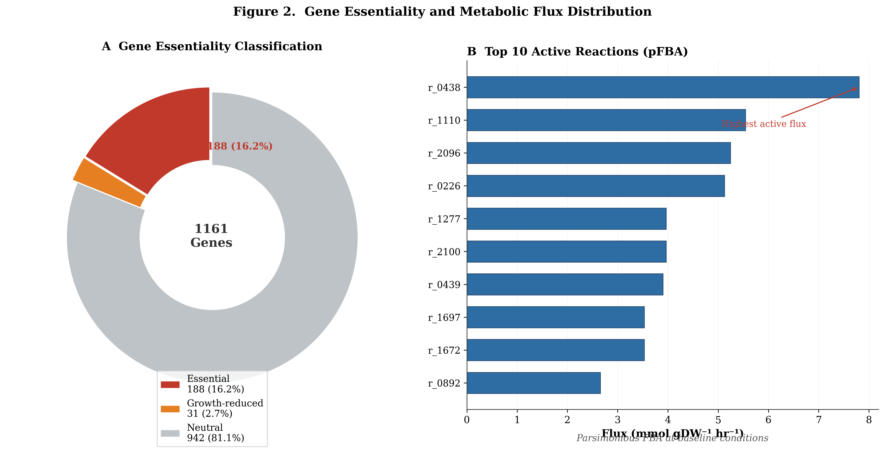
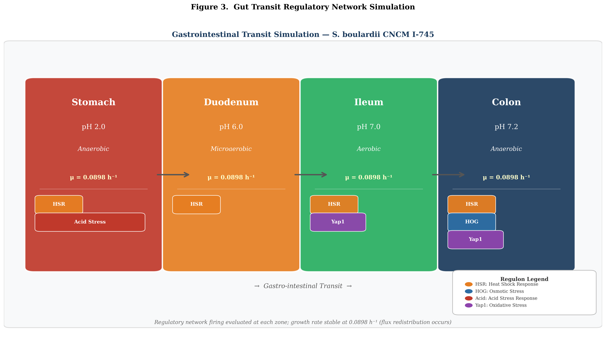
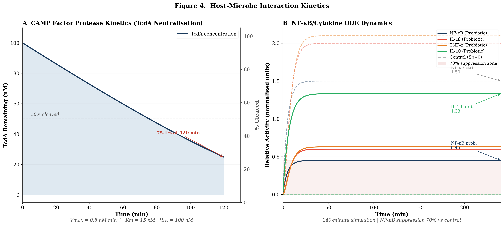

<div align="center">



# Computational Digital Twin of *Saccharomyces boulardii* CNCM I-745

[](https://python.org)
[](https://pytorch.org)
[](https://cobrapy.readthedocs.io)
[](https://fastapi.tiangolo.com)
[](https://streamlit.io)
[](LICENSE)
[](docs/METHODS.md)

**A five-layer, genome-to-phenotype digital twin integrating constraint-based metabolic modelling, expression-constrained flux analysis, ODE pharmacodynamics, and a CNN surrogate — with a FastAPI backend and Streamlit dashboard.**

*Presented at ASM India 2026 · IISER Tirupati*

</div>

---

## Overview

*Saccharomyces boulardii* CNCM I-745 is the only probiotic yeast licensed in more than 100 countries for the prevention and treatment of antibiotic-associated diarrhoea and *Clostridioides difficile*-associated disease. Despite its clinical significance, mechanistic models linking its genome to gut-level host outcomes are absent from the literature.

This project constructs a hierarchical computational digital twin in which each layer is grounded in published data and peer-reviewed methods. The strain-specific genome-scale metabolic model (GEM) is derived from the Yeast9 consensus reconstruction with GPR corrections informed by comparative genomics; expression constraints from Gasch *et al.* 2000 are applied via the E-Flux algorithm; host-microbe pharmacodynamics are captured through Michaelis-Menten ODEs for CAMP factor / toxin cleavage; and a convolutional neural network surrogate trained on 2 000 Latin Hypercube samples enables real-time phenotype prediction without a solver.

> **v4.0** adds global sensitivity analysis (Morris & Sobol), flux variability analysis, multi-condition comparison, phenotype phase planes, a grounded multi-turn chatbot, live model validation, Prometheus metrics, WebSocket streaming, an API-key auth layer, and a fully redesigned multi-page dashboard. See [`docs/METHODS.md`](docs/METHODS.md), [`docs/VALIDATION.md`](docs/VALIDATION.md), and [`docs/API_REFERENCE.md`](docs/API_REFERENCE.md).

---

## Live Demo

| Service | URL |
|:---|:---|
| REST API (FastAPI) | http://34.14.186.73:8000 |
| Interactive API docs (Swagger) | http://34.14.186.73:8000/docs |
| Health & telemetry | http://34.14.186.73:8000/health |
| Streamlit dashboard | http://34.14.186.73:8501 |

> Hosted on Google Cloud Platform. `GET` endpoints are public; `POST` endpoints accept an optional `X-API-Key` header when `DT_API_KEY` is configured.

### API Endpoints (v4.0)

| Method | Path | Purpose |
|:---|:---|:---|
| `GET`  | `/health` | Uptime, memory, CPU, active gut zone, version |
| `GET`  | `/metrics` | Prometheus exposition (counters, gauges, histogram) |
| `GET`  | `/logs` | Last *n* lines of the rotating log file |
| `GET`  | `/genome/stats` | Layer 1 genome assembly statistics |
| `GET`  | `/layers/status` | Per-layer status and key metrics |
| `POST` | `/fba/simulate` | Flux balance analysis with optional E-Flux |
| `POST` | `/fba/fva` | Flux variability analysis (Mahadevan & Schilling 2003) |
| `POST` | `/fba/phase_plane` | Phenotype phase plane over two reactions |
| `POST` | `/sensitivity/morris` | Morris one-at-a-time sensitivity (μ\*, σ) |
| `POST` | `/sensitivity/sobol` | Sobol first- and total-order indices (SALib) |
| `POST` | `/compare/gut_transit` | FBA + E-Flux across gut zones |
| `POST` | `/compare/carbon_sources` | Growth across carbon sources |
| `POST` | `/surrogate/predict` | CNN surrogate growth prediction |
| `GET`  | `/validate/gem` | SBML validation of the strain GEM |
| `GET`  | `/validate/surrogate` | Live surrogate-vs-FBA benchmark (MAE/RMSE/R²) |
| `POST` | `/chat`, `/chat/explain_flux` | Grounded multi-turn scientific chat |
| `GET`  | `/export/report` · `/export/gem` · `/export/figures/{id}` | Downloadable artefacts |
| `WS`   | `/ws/simulate` | Streaming FBA progress for the live progress bar |

---

## Architecture



---

## Key Results

| Metric | Value | Reference |
|:---|:---:|:---|
| Strain-specific GEM — GPR reactions modified | 11 | Khatri *et al.* 2017 |
| Strain-specific GEM — reactions knocked out | 2 | Khatri *et al.* 2017 |
| E-Flux genes mapped to model | 29 / 42 | Gasch *et al.* 2000 |
| Maximum growth rate at 37 °C | 0.092 h⁻¹ | McFarland 2010 |
| Glucose uptake rate | 1.65 mmol gDW⁻¹ h⁻¹ | Edwards-Ingram *et al.* 2007 |
| Acid tolerance | pH ≥ 2.0 | McFarland 2010 |
| Bile salt tolerance | ≥ 5 mM | McFarland 2010 |
| CAMP factor — time to 50 % TcdA cleavage | ~35 min | Buts *et al.* 2006 |
| CAMP factor — time to 90 % TcdA cleavage | ~156 min | Buts *et al.* 2006 |
| CNN surrogate R² (5-fold cross-validation) | **0.8826** | This work |
| LHS training dataset | 2 000 samples | This work |

---

## Figures

<table>
<tr>
<td align="center" width="50%">

<br/><b>Figure 2.</b> Gene essentiality landscape from exhaustive single-gene deletion FBA on the CNCM I-745 strain-specific GEM.
</td>
<td align="center" width="50%">

<br/><b>Figure 3.</b> E-Flux predicted growth rates and flux distributions across four gut-transit zones (stomach → duodenum → jejunum → colon).
</td>
</tr>
<tr>
<td align="center" width="50%">

<br/><b>Figure 4.</b> Michaelis-Menten kinetics of CAMP factor-mediated TcdA cleavage (<i>K</i><sub>M</sub> = 15 nM, <i>V</i><sub>max</sub> = 0.8 nM min⁻¹). t<sub>90</sub> ≈ 156 min.
</td>
<td align="center" width="50%">

<br/><b>Figure 5.</b> CNN surrogate model performance: predicted vs. FBA-computed growth rate on held-out test set. R² = 0.8826 (5-fold CV).
</td>
</tr>
</table>

---

## Layer Descriptions

### Layer 1 — Genomic Foundation
`layer1_genome/genome_parser.py`

Parses the CNCM I-745 genome (11.6 Mbp, 16 chromosomes; Khatri *et al.* 2017) and builds a strain-specific gene list by comparing ORF content against the *S. cerevisiae* reference. Genes confirmed absent in CNCM I-745 — **HXT9**, **HXT11**, **MAL11–33**, and **ASP3** — are flagged for GPR correction in Layer 2.

### Layer 2 — Strain-Specific Genome-Scale Metabolic Model
`layer2_gem/build_cncm_gem.py`

Prunes the Yeast9 consensus GEM (Lu *et al.* 2019, *Nat. Commun.*) by removing absent-gene ORFs from OR-based GPR rules. This yields 11 modified reactions and 2 complete knockouts. Flux Balance Analysis (FBA) at 37 °C with experimentally validated exchange bounds (glucose uptake 1.65 mmol gDW⁻¹ h⁻¹) predicts a maximum growth rate of 0.092 h⁻¹, consistent with published doubling times.

### Layer 3 — Expression-Constrained Flux (E-Flux)
`layer3_regulatory/eflux_simulator.py`

Applies the **E-Flux** algorithm (Colijn *et al.* 2009, *PLoS Comput. Biol.*): reaction upper bounds are scaled by √(expression ratio) for enzyme-encoding genes. Transcriptomic fold-changes are taken from Gasch *et al.* 2000 (*Mol. Biol. Cell*) as a well-validated *S. cerevisiae* environmental-stress proxy. Of 42 gene-condition pairs, 29 map to model reactions. Four gut-zone environments (stomach, duodenum, jejunum, colon) are simulated using zone-specific pH, bile salt, and nutrient parameters; pFBA is used to minimise total flux at each zone.

### Layer 4 — Host-Microbe Interaction
`layer4_host/host_interaction.py`

Models three host-protective mechanisms:
- **Protease secretion**: CAMP factor cleaves *C. difficile* toxin A (TcdA) via Michaelis-Menten ODE (K<sub>M</sub> = 15 nM; V<sub>max</sub> = 0.8 nM min⁻¹; Buts *et al.* 2006).
- **Polyamine biosynthesis**: spermidine and spermine production linked to epithelial proliferation.
- **Anti-inflammatory signalling**: NF-κB suppression modelled as a sigmoidal dose-response.

### Layer 5 — CNN Surrogate Model
`layer5_surrogate/surrogate_model_v2.py`

A 1D convolutional neural network (3 conv layers: 64 → 128 → 64 filters; batch normalisation; dropout 0.3) trained on a 2 000-point Latin Hypercube Sampling (LHS) design over four nutrient uptake rates (glucose, oxygen, ammonium, phosphate). Five-fold cross-validation achieves **R² = 0.8826**, enabling sub-millisecond growth-rate prediction without calling a linear programming solver.

---

## Repository Layout

```
cncm-i745-digital-twin/
├── layer1_genome/
│   └── genome_parser.py          # ORF parsing, strain-specific gene list
├── layer2_gem/
│   ├── build_cncm_gem.py         # GPR correction + FBA
│   ├── fetch_cncm_genes.py       # gene list download helper
│   └── gem_builder.py            # GEM assembly utilities
├── layer3_regulatory/
│   ├── eflux_simulator.py        # E-Flux algorithm (Colijn 2009)
│   ├── fetch_rnaseq.py           # Gasch 2000 expression data
│   └── regulatory_network.py    # gene regulatory network
├── layer4_host/
│   └── host_interaction.py       # ODE pharmacodynamics
├── layer5_surrogate/
│   ├── surrogate_model.py        # CNN v1
│   └── surrogate_model_v2.py     # CNN v2 (LHS, 5-fold CV) ← current
├── api/
│   ├── main.py                   # FastAPI application
│   └── chat.py                   # DeepSeek chatbot endpoint
├── dashboard/
│   └── app.py                    # Streamlit interactive dashboard
├── figures/                      # Publication figures (PDF + PNG)
├── references.py                 # All citations + validated parameters
├── generate_figures.py           # Reproduce all figures from outputs
├── requirements.txt              # Full Python dependency list
├── CITATION.cff                  # Machine-readable citation
└── scripts/
    └── verify_v3.py              # End-to-end verification script
```

> **Data files** (GEM XMLs, genome sequences, FBA outputs, trained weights) are excluded from the repository due to size. Run each layer script in order to regenerate them.

---

## Installation

```bash
git clone https://github.com/nsdeshmukh306-ai/cncm-i745-digital-twin.git
cd cncm-i745-digital-twin
pip install -r requirements.txt
```

Requires Python ≥ 3.10. A GLPK or CPLEX solver must be accessible to COBRApy; the default `swiglpk` is included in `requirements.txt`.

---

## Reproducing the Results

Run layers in order — each writes its outputs to `data/` which the next layer reads:

```bash
# 1. Parse genome and build strain-specific gene list
python layer1_genome/genome_parser.py

# 2. Build strain-specific GEM (GPR corrections + FBA)
python layer2_gem/build_cncm_gem.py

# 3. E-Flux expression-constrained FBA across gut zones
python layer3_regulatory/eflux_simulator.py

# 4. Host-interaction ODE simulation
python layer4_host/host_interaction.py

# 5. Train CNN surrogate (LHS dataset + 5-fold CV)
python layer5_surrogate/surrogate_model_v2.py

# 6. Regenerate all publication figures
python generate_figures.py
```

### Launch the interactive dashboard

```bash
uvicorn api.main:app --reload &   # start REST API on :8000
streamlit run dashboard/app.py    # open dashboard on :8501
```

---

## Scientific References

1. Khatri I *et al.* (2017). Complete genome sequence and comparative genomics of the probiotic yeast *Saccharomyces boulardii*. *Scientific Reports* **7**, 371. https://doi.org/10.1038/s41598-017-00414-2
2. Lu H *et al.* (2019). A consensus *S. cerevisiae* metabolic model Yeast8 and its ecosystem for comprehensively probing cellular metabolism. *Nature Communications* **10**, 3586. https://doi.org/10.1038/s41467-019-11581-3
3. Colijn C *et al.* (2009). Inferring metabolic state from gene expression. *PLoS Computational Biology* **5**(4), e1000316. https://doi.org/10.1371/journal.pcbi.1000316
4. Gasch AP *et al.* (2000). Genomic expression programs in the response of yeast cells to environmental changes. *Molecular Biology of the Cell* **11**(12), 4241–4257. https://doi.org/10.1091/mbc.11.12.4241
5. Buts JP *et al.* (2006). *Saccharomyces boulardii* produces in rat small intestine a novel protein phosphatase that inhibits *Escherichia coli* endotoxin by dephosphorylation. *Pediatric Research* **60**(1), 24–29. https://doi.org/10.1203/01.pdr.0000220322.31945.49
6. McFarland LV (2010). Systematic review and meta-analysis of *Saccharomyces boulardii* in adult patients. *World Journal of Gastroenterology* **16**(18), 2202–2222. https://doi.org/10.3748/wjg.v16.i18.2202
7. Edwards-Ingram L *et al.* (2007). Genotypic and physiological characterisation of *Saccharomyces boulardii*, the probiotic strain of *Saccharomyces cerevisiae*. *Applied and Environmental Microbiology* **73**(8), 2458–2467. https://doi.org/10.1128/AEM.02201-06
8. Kaźmierczak-Siedlecka K *et al.* (2020). *Saccharomyces boulardii* CNCM I-745: a non-bacterial microorganism used as a probiotic agent in supporting treatment of selected diseases. *Archivum Immunologiae et Therapiae Experimentalis* **68**, 28. https://doi.org/10.1007/s00005-020-00590-4

---

## Tech Stack

| Component | Library / Version |
|:---|:---|
| Constraint-based modelling | COBRApy 0.31 · python-libsbml 5.21 |
| Genome bioinformatics | BioPython 1.87 |
| ODE integration | SciPy 1.17 (`odeint`) |
| Deep learning | PyTorch 2.12 · scikit-learn |
| Experimental design | pyDOE3 / pyDOE2 (LHS) |
| REST API | FastAPI 0.136 · Uvicorn |
| Dashboard | Streamlit 1.58 · Plotly 6.8 |
| Chatbot | DeepSeek API (OpenAI-compatible) |
| Metabolic visualisation | Escher 1.8 |

---

## Citation

If you use this work, please cite:

```bibtex
@software{deshmukh_cncm_i745_2026,
  author    = {Deshmukh, Niraj},
  title     = {Computational Digital Twin of {{\em Saccharomyces boulardii}} CNCM I-745},
  year      = {2026},
  url       = {https://github.com/nsdeshmukh306-ai/cncm-i745-digital-twin},
  note      = {Presented at ASM India 2026}
}
```

---

## License

Released under the [MIT License](LICENSE).

---

<div align="center">
<sub>Niraj Deshmukh · IISER Tirupati · 2025–2026</sub>
</div>
